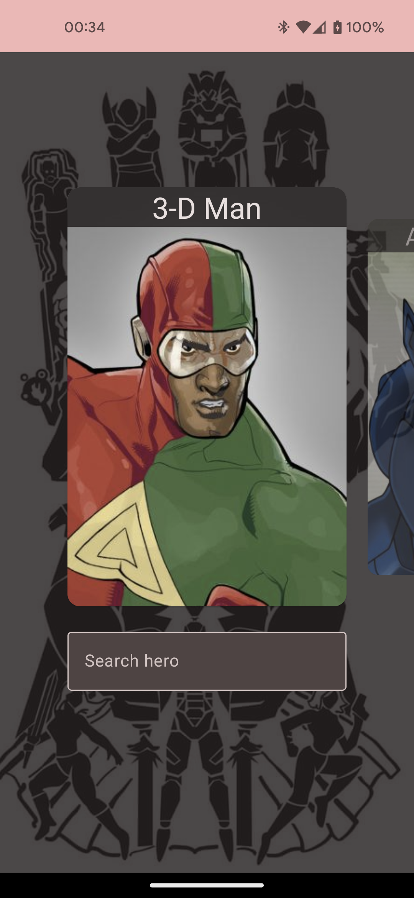
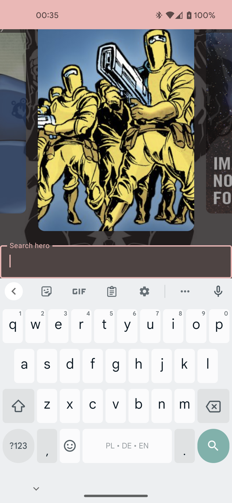
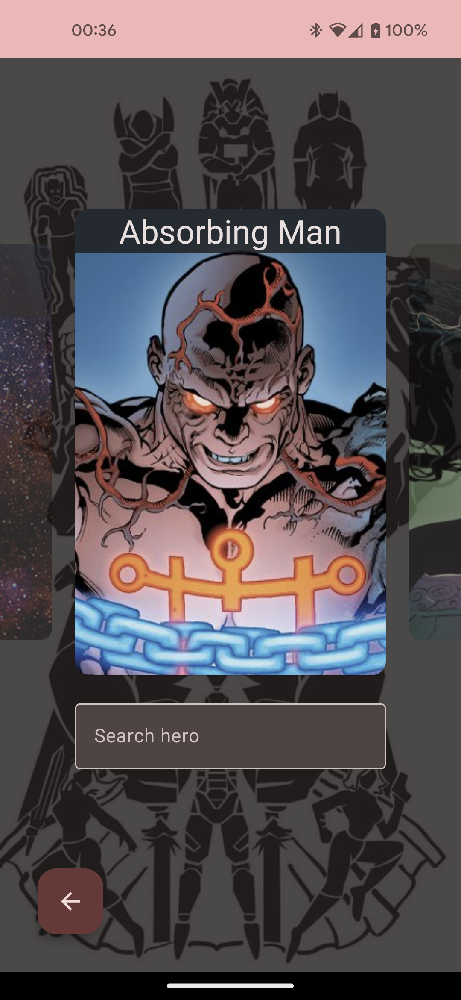
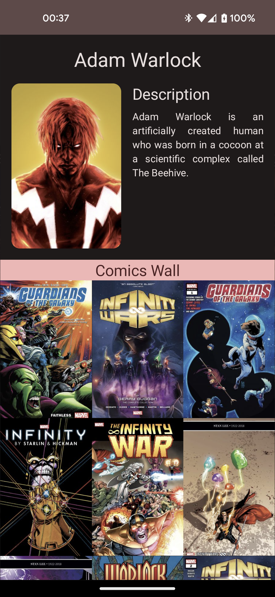

# MarvelHeroes

Android application listing all possible super heroes from Marvel universe.

## Features

- Listing gallery styled collection of heroes
- Scrolling pagination on heroes collection
- Activate scroll to first button after reaching threshold (5 heroes)
- Search bar with live searching in Marvel API
- Hero detail page with description and collection of comics

### Effects
- Shimmer loading effect
- Custom side vertical indicator when loading more heroes
- Custom transition to hero details
- Expandable search bar attached to the keyboard

### Screenshots & recording

|Main|Search|Scroll To First|Details|
|---|---|---|---|
|||||

[Download recording here](screenshots/recording.mp4)

## Tech
- Jetpack Compose for UI
- Hilt for dependency injection
- Timber for logging
- Retrofit for networking
- GitHub Actions for CI

I have used MVVM pattern and decided on using single module since this is a very small app and I wanted to focus more on UI. 
Nevertheless, I have maintained package structure that would allow separation for multi module project.
I am willing to discuss my choices on tech interview.

## Setup
App is based on [Marvel API](https://developer.marvel.com/) therefore require providing API KEY. 

Add `API_KEY="<YOUR_KEY>"` to `local.properties` file in the root of the project.

Github Actions loads mine API key from secrets to be able to build and run checks.
